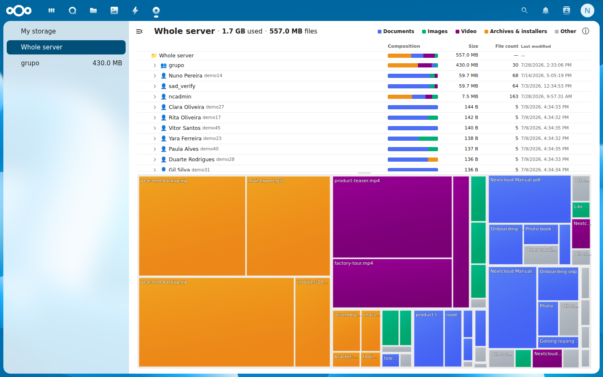
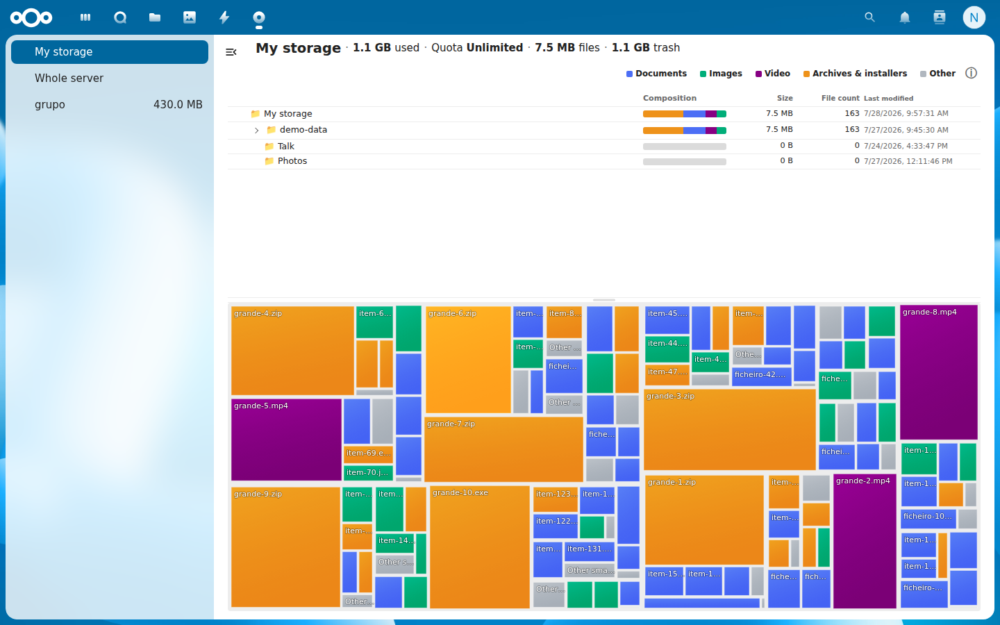
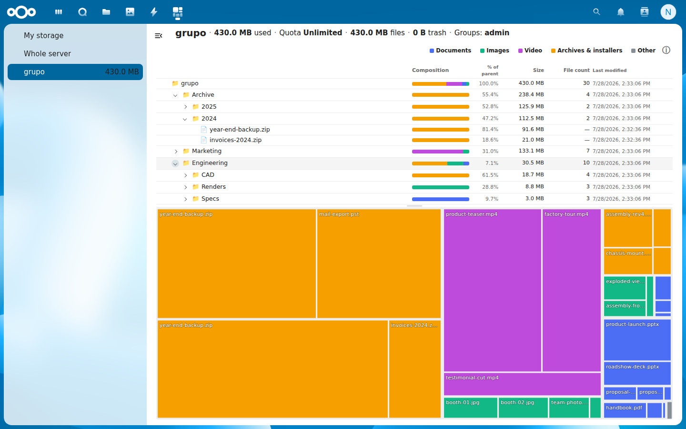
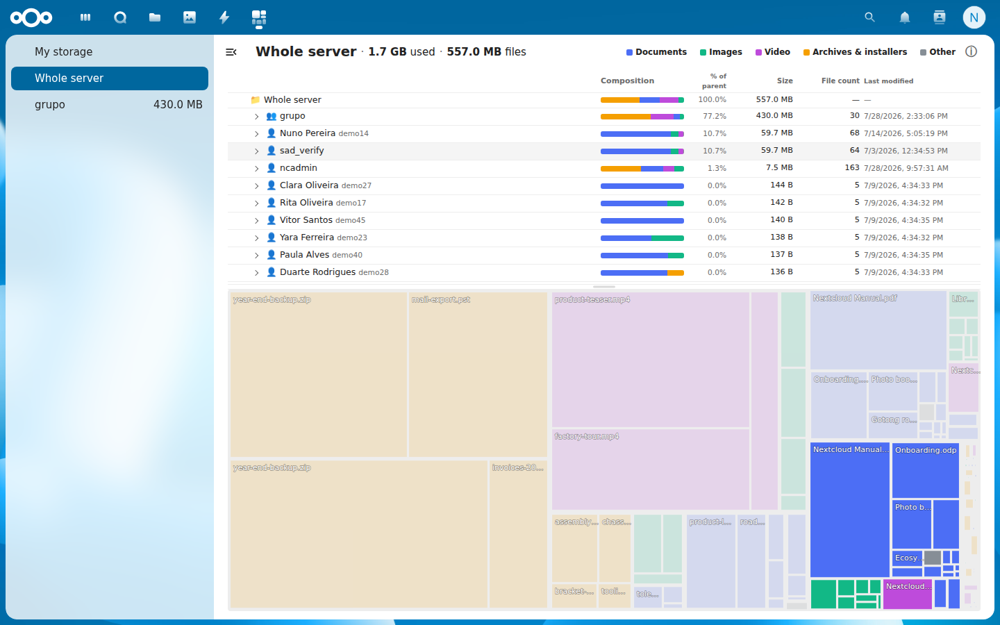

<!--
  - SPDX-FileCopyrightText: 2026 Ricardo Ferreira <rsfneg@gmail.com>
  - SPDX-License-Identifier: AGPL-3.0-or-later
  -->

# DiskMap for Nextcloud

**See where your storage is going — a WinDirStat-style treemap for your whole
Nextcloud, without scanning a single file.**

DiskMap gives administrators an instance-wide picture of storage usage, every
account, team folder and external storage and gives every user the same view
of their own files. It pairs a treemap with an expandable folder tree, kept in
sync both ways, so you can get from *"the server is full"* to *"that folder is
why"* in a few clicks.

<a href="https://ateeducacion.github.io/nextcloud-playground/?blueprint-url=https://raw.githubusercontent.com/kreotropic/diskmap/refs/heads/main/blueprint.json" target="_blank" rel="noopener noreferrer"></a>



## Problem Solved

When a Nextcloud instance fills up, finding out *what* filled it is
surprisingly hard. `occ files:scan` says nothing about sizes, the quota column
only shows totals, and the Files app has no "sort the whole server by size"
view. The usual fallback, running `du` on the data directory needs shell
access, returns opaque hashed paths, and hammers the disk on a live server.

DiskMap answers the question from data Nextcloud already keeps. Every folder's
recursive size is already stored in the file cache and updated on every file
operation, so the entire view is a database read: **no filesystem scan, no disk
I/O, no background job.**

## Features

### For administrators

- **Whole server** — every account, team folder and external storage as a
  top-level entry, browsable down to individual files, sorted by size so the
  biggest consumers are the first thing you see.
- **Team folders** — used space, quota and occupancy, with a files / trash /
  versions breakdown and the groups or teams linked to each folder.
- **Real display names** — accounts show their human name next to the raw uid,
  so an LDAP/AD instance with opaque UUID logins stays readable.
- **Orphans surfaced, not hidden** — a storage left behind by a deleted team
  folder still appears, because space you have forgotten about is exactly the
  space worth finding.

### For every user

- **My storage** — the same treemap and folder tree over your own files, with
  quota occupancy and a files / trash / versions breakdown.

### In every view

- **Two-way map ↔ tree sync** — click a tile on the map and the tree opens and
  scrolls to that file; click a row in the tree and the map highlights its
  whole region, dimming everything else.
- **Composition bars** — every folder row shows what it is *made of*
  (documents, images, video, archives, other), recursively, so a 100 GB video
  library is distinguishable from a 100 GB backup dump at a glance.
- **Category filter** — click a legend entry to dim everything that is not
  that category across the whole map.
- **Cache timestamp** — every view states when the underlying file cache entry
  was last updated, so it stays clear that this reflects what Nextcloud knows,
  not a live disk read.

## Try it in Nextcloud Playground

Click the badge above (or [this
link](https://ateeducacion.github.io/nextcloud-playground/?blueprint-url=https://raw.githubusercontent.com/kreotropic/diskmap/refs/heads/main/blueprint.json))
to open a full Nextcloud instance running entirely in your browser (via
WebAssembly). It boots with DiskMap installed, the admin already logged in,
and a few extra accounts seeded with files of different sizes, so the **Whole
server** treemap has something to show the moment it opens.

No local setup or Docker required. The instance is provisioned from
[`blueprint.json`](blueprint.json) at the repository root using the
[`installApp`](https://github.com/ateeducacion/nextcloud-playground/blob/main/docs/blueprint-json.md#installapp)
step, which installs the release tarball straight from this repository's
GitHub releases.

> **Playground caveat:** the Playground runs Nextcloud on SQLite, which
> DiskMap deliberately does not support (see [Known
> Limitations](#known-limitations)) — `occ app:enable` refuses the app there,
> even with `--force`. The blueprint therefore extracts the app without
> enabling it, adds `sqlite` to the `<database>` list of the *demo instance's*
> copy of `info.xml`, and only then enables it. That patch exists only inside
> the throwaway browser instance; the shipped app is unchanged. The treemap,
> folder tree and every size figure work — they use portable queries — but
> the *Composition* and *File count* columns stay blank, as those queries
> only have MySQL/MariaDB and PostgreSQL spellings. A real instance on a
> supported database shows them fully.

## Installation

### Via App Store (Recommended)
1. Go to **Apps** in your Nextcloud
2. Search for "DiskMap"
3. Click **Install**

### Manual Installation
```bash
cd /path/to/nextcloud/apps
git clone https://github.com/kreotropic/diskmap.git diskmap
php occ app:enable diskmap
```

> **Note:** compiled JavaScript is included in the repository, so `npm install`/`npm run build` are only needed if you modify the frontend source.

## Usage

Open **DiskMap** from the app menu. The navigation on the left lists:

- **My storage** — your own files; every user sees this.
- **Whole server** — the instance-wide view; administrators only.
- One entry per **team folder**, with its current size; administrators only.

Click a folder in the tree to highlight its region on the map, or a tile on the
map to reveal that file in the tree. DiskMap is read-only — there is nothing to
configure, and nothing in it can change or delete a file.

### Restricting who sees DiskMap

DiskMap has no visibility setting of its own, on purpose: Nextcloud's built-in
per-app group restriction already does this, and does it more thoroughly than
an in-app toggle could. To make DiskMap administrator-only, go to
**Settings → Apps → DiskMap** and pick *Enable for specific groups*, or run:

```bash
php occ app:enable diskmap --groups=admin     # restrict
php occ app:enable diskmap                    # back to everyone
```

Restricted accounts lose the app completely, it disappears from the app menu,
and every page and API endpoint answers *App is not enabled* at the framework
level, before any DiskMap code runs. A settings toggle inside the app could
only have hidden the navigation entry.

Note this restricts by *group*, not by administrator status: delegated
administrators outside the `admin` group would be excluded too. Any group works
if you want a different audience.

Worth deciding deliberately rather than by default, though. The per-user view is
strictly scoped to the caller's own files, it cannot reveal anyone else's data
and letting people see what is filling their own quota tends to *reduce* support
requests rather than create them.

## Known Limitations

- **It reports what the file cache knows, not what is on disk right now.**
  Never scanning the filesystem is the whole point of the design, so files
  added outside Nextcloud stay invisible until an `occ files:scan` records
  them. Every view shows the cache timestamp so you can judge freshness.

- **No SQLite support.** MySQL/MariaDB and PostgreSQL are both supported and
  tested; SQLite is declared out rather than left to fail at runtime, since the
  path-segment expression the composition queries group by needs a third
  spelling there that has no coverage.

- **On PostgreSQL, composition queries scan a whole storage rather than just
  the subtree.** Not a difference in the SQL: Nextcloud's own
  `fs_storage_path_prefix` index is a `(storage, path(64))` prefix index, which
  PostgreSQL has no equivalent for, so core deliberately skips creating it
  there (there is an explicit PostgreSQL exclusion around it in core's
  `AddMissingIndicesListener`, so `occ db:add-missing-indices` will not add it
  either). With
  nothing to range-scan, folder composition costs time proportional to the
  account or team folder it lives in instead of to the folder itself. Results
  are identical either way, and the per-folder cache absorbs repeat visits.
  Measured on a synthetic 300k-row storage: 51 ms to break down a 300-file
  folder (MySQL does it in a few ms), but 176 ms to break down all 301k rows,
  where MySQL takes 1421 ms — a parallel scan wins whenever the answer needs
  every row anyway. See the PostgreSQL performance note under
  [Requirements](#requirements) if you want the bounded behaviour back.

- **Team-folder and whole-server views are administrator-only.** A user
  restricted by advanced ACL to part of a team folder must never learn the
  total size of the parts they cannot see, so these scopes are not exposed to
  non-administrators at all. An ACL-aware per-user team folder view is future
  work, not a setting you can switch on.

- **The map is node-budgeted, so very large scopes trade detail, never
  accuracy.** Past the budget a folder stays a single tile sized by its own
  recursive total, and individually tiny files fold into one "other" tile.
  Sizes always add up exactly; what you lose is granularity, the same way a
  collapsed branch works in WinDirStat.

- **Trash and versions count toward the header total but are not browsable.**
  The tree and map descend into files only, which is why each header shows both
  a *used* figure (files + trash + versions) and a *files* figure — the gap
  between them is space the map never draws a tile for.

- **External storages are labelled by their raw storage id**, not the mount
  point you configured. There is no stable way to join a storage back to its
  external-mount configuration across backend types, so the name can look
  technical (e.g. `tmp/nc-exttest`).

- **Per-folder file counts and composition cost a real query**, unlike sizes,
  which the file cache has already aggregated. They are batched wherever
  possible, but they remain the most expensive part of loading a large view.

## Translations

The app interface is available in:

- **English** (default)
- **Portuguese (Portugal)** / Português (Portugal)
- **German** / Deutsch
- **Spanish** / Español

Contributions for additional languages are welcome — add a `l10n/<locale>.json`
and regenerate the matching `l10n/<locale>.js` with `python3 build/l10n.py`.

## Requirements

- Nextcloud 32–35
- PHP 8.1 or later (tested up to PHP 8.5, which Nextcloud 34 and 35 ship with)
- MySQL/MariaDB or PostgreSQL (not SQLite)
- Redis or Memcached recommended — account display names are read through
  Nextcloud's distributed cache, which is what keeps the whole-server view
  cheap on instances with many accounts

### Optional: PostgreSQL index for large instances

DiskMap works on PostgreSQL with no setup. But because core has no
`fs_storage_path_prefix` index there (see [Known
Limitations](#known-limitations)), every folder-composition query scans the
whole storage it belongs to. On a large instance you can restore the bounded
behaviour by adding an index PostgreSQL *can* use for prefix matching:

```sql
CREATE INDEX CONCURRENTLY fs_storage_path_pattern
    ON oc_filecache (storage, path varchar_pattern_ops);
```

`varchar_pattern_ops` is the part that matters — a plain index on the same
columns will not serve `LIKE 'folder/%'` unless the database was created with
the `C` collation.

Measured on a synthetic 300k-row storage, breaking down one 300-file folder
went from **51 ms to 3.0 ms**, and a whole 6k-descendant level from 34 ms to
22 ms. Whole-storage aggregates are unaffected: they read every row regardless,
and PostgreSQL correctly keeps using a parallel scan for those. The index cost
about 17 MB against a 62 MB table.

This is left to administrators on purpose. `oc_filecache` belongs to Nextcloud
core, not to this app, so DiskMap will not add or drop indexes on it — and
`CONCURRENTLY` keeps the creation from locking the table on a live instance.
Drop it again at any time with `DROP INDEX CONCURRENTLY fs_storage_path_pattern;`

## License

[AGPL-3.0-or-later](LICENSE) © Ricardo Ferreira.

## Development

The frontend is Vue 3 + `@nextcloud/vue`, with `d3-hierarchy` used purely for
treemap layout maths (it never touches the DOM). The backend reads
`oc_filecache`, `oc_storages`, `oc_mimetypes` and the team folder tables
directly, behind a scope-based read API. See `lib/` and `src/`.

### Tests

Development dependencies (PHPUnit, PHPStan) are not shipped — install them first:

```bash
composer install
vendor/bin/phpunit
vendor/bin/phpstan analyse
```

Both run in CI (`.github/workflows/ci.yml`) on every push — run them locally
before pushing rather than finding out there.

### Cross-engine checks

DiskMap runs on MySQL/MariaDB and on PostgreSQL, and
`tests/Unit/FilecacheDialectTest.php` pins the SQL generated for each engine
without needing a database at all — run it after touching any of the
composition queries.

For an end-to-end comparison there is a disposable instance per engine, plus a
deterministic fixture to give both. See [build/README.md](build/README.md).

### Frontend build

Compiled JavaScript is committed to the repository, so a build is only needed
when you change the Vue/JS sources under `src/`:

```bash
npm install
npm run build      # production build
npm run watch      # rebuild on change
```

### Translations build

After editing a translation, regenerate the frontend `l10n/*.js` bundles from
the `l10n/*.json` sources (and check for missing/orphaned strings):

```bash
python3 build/l10n.py           # regenerate all l10n/<lang>.js
python3 build/l10n.py --check   # CI: fail if strings are missing
```

## Contributing

Pull requests welcome! Please open an issue first to discuss significant changes.

## Screenshots

| My storage (per-user view) | Team folder detail |
|---|---|
|  |  |



*The snapshots above show the admin whole-server view, the per-user personal
view, a team folder broken down by folder and file type, and the tree→map sync
lighting up one account's region while dimming the rest.*


## Changelog

See [CHANGELOG.md](CHANGELOG.md) for the full version history.

## Support

- Issues: [GitHub Issues](https://github.com/kreotropic/diskmap/issues)
- Forum: [Nextcloud Community](https://help.nextcloud.com)

## Author

Ricardo Ferreira
